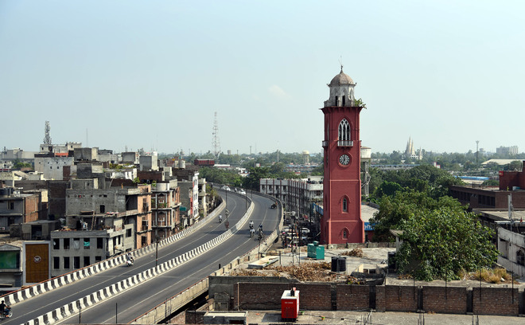

# LUDHIANA

**Ludhiana city** is known as the industrial hub of Punjab, whose roots go back to the 15th century. This vivacious city has turn out to be a colourful bouquet of different cultures, thanks to its industrial status. The inventive & creative urge of the Ludhianivis noticeable itself beautifully in various industrial activities. Ludhiana has time & again been called the **Manchester of India**. Industries manufacturing Cycle & its parts, Woolens, Machine Tools, Sewing Machines, Generators, Diesel Engines, Tyres & Tubes and a host of other utilities and consumer goods dot the map of Ludhiana. The industrial products & hosiery manufactured in Ludhiana are not only used within India but they are also exported to different regions of the world.

## KNOW MORE ABOUT LUDHIANA
* Ludhiana, the only Industrial city in Northern India, stands on the G.T Rd from Delhi to Amritsar.
* Ludhiana is a District Headquarter with Parliamentary Constituency of the same name.
* Ludhiana is one of the Four Municipal Corporations of the State.
* Ludhiana is Fastest-growing city in India. Its Population according to provisional figures of 2001 Census was 3030352 besides very large migrant population more than 10 lacs approximately.
* Ludhiana has got the highest per capita vehicles in India. Every 3 months more than 10000 vehicles are added in the city.
* Ludhiana is the Business Capital of Punjab, though the Official Capital of Punjab is Chandigarh.

| Population    | Area Sq. Km.  | Child Population  | Male Population | Female Population |
| ------------- |:-------------:| -----:            | -----:          | -----:            | 
| 34.99 Lakhs   | 3578          | 384,114           | 206,502         | 177,612           |

## For More Info
[Click Here! ](https://www.census2011.co.in/census/district/594-ludhiana.html)